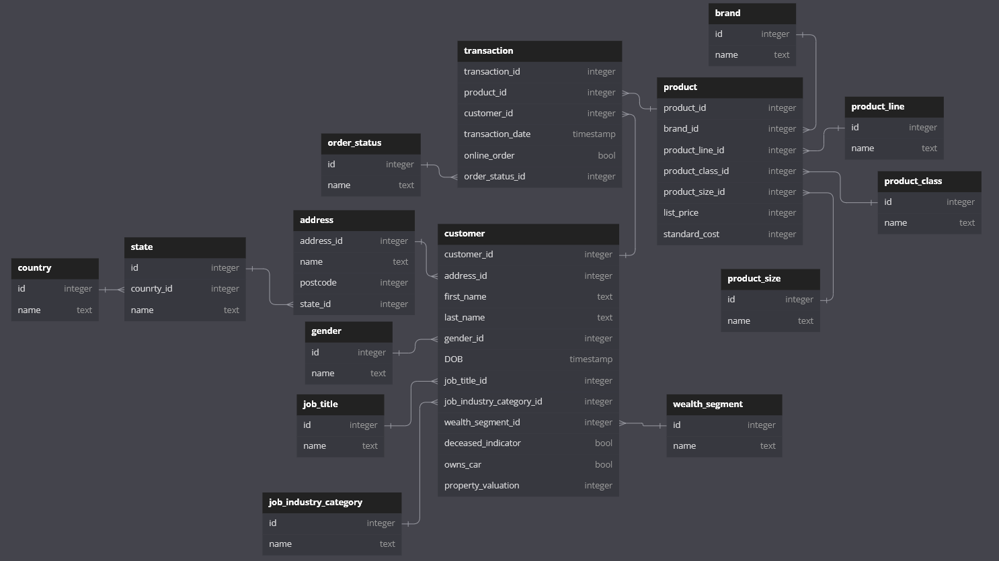

# Дз1

Изначальные две таблицы customer и transactions уже находились в 1НФ.
Я привожу БД к 3НФ (Смотри диаграмму ниже). Для этого я разбил данные на три основных таблицы transaction, product, customer и несколько справочных таблиц.

Вместо создания заголовков таблиц и потом вставки данных через ```CREATE``` и ```INSERT``` я использовал метод ```to_sql``` из ```pandas``` с библиотекой ```sqlalchemy```

## Основные таблицы:
- Таблица customer содержит информацию о клиентах, включая уникальный идентификатор клиента (customer_id), адрес (address_id), имя (first_name), фамилию (last_name), пол (gender_id), дату рождения (DOB), должность (job_title_id), отрасль работы (job_industry_category_id), сегмент богатства (wealth_segment_id), индикатор умерших (deceased_indicator), владение автомобилем (owns_car) и оценку имущества (property_valuation).
- Таблица product содержит информацию о продуктах, включая уникальный идентификатор продукта (product_id), бренд (brand_id), линейку продуктов (product_line_id), класс продукта (product_class_id), размер (product_size_id), рекомендованную розничную цену (list_price) и стандартную стоимость (standard_cost).
- Таблица transaction учитывает транзакции, включая уникальный идентификатор транзакции (transaction_id), продукт (product_id), клиента (customer_id), дату транзакции (transaction_date), онлайн заказ (online_order) и статус заказа (order_status_id).

## Справочники:
- Таблицы job_title, job_industry_category, wealth_segment, gender, и address содержат справочную информацию, связанную с соответствующими атрибутами клиентов: должности, отрасли работы, сегменты богатства, пола и адреса соответственно.
- Таблица state и country предоставляют информацию о географическом расположении, связывая адреса с конкретными штатами и странами.
- Таблицы brand, product_line, product_class, и product_size содержат справочную информацию о брендах, линейках продуктов, классах продуктов и размерах продуктов соответственно.
- Таблица order_status предоставляет информацию о статусах заказов.

# Диаграмма


## Файлы проекта
- ```hw1_data.xlsx``` - оригинальный датасет
- ```pg_py.ipynb``` - код на python для импорта датасета в postgres, а так же создание справочников в цикле
- ```sql_script.sql``` - код на sql для создание основных таблиц и нестандартных справочных таблиц
